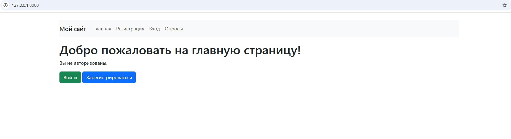
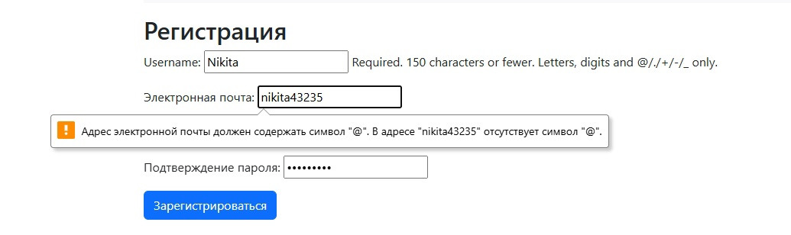
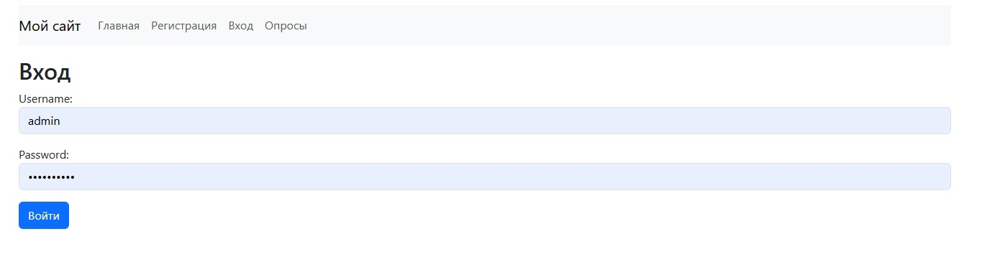
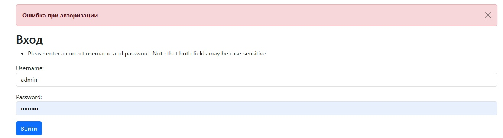
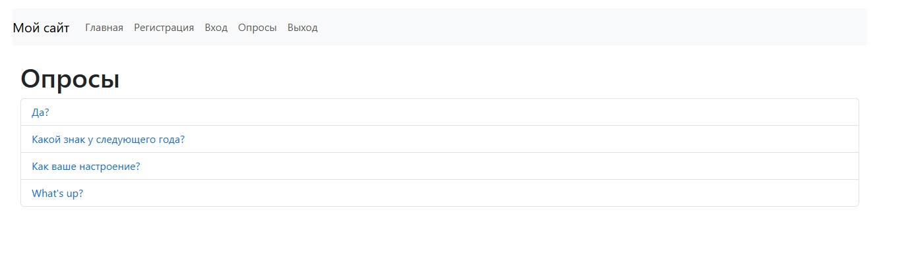
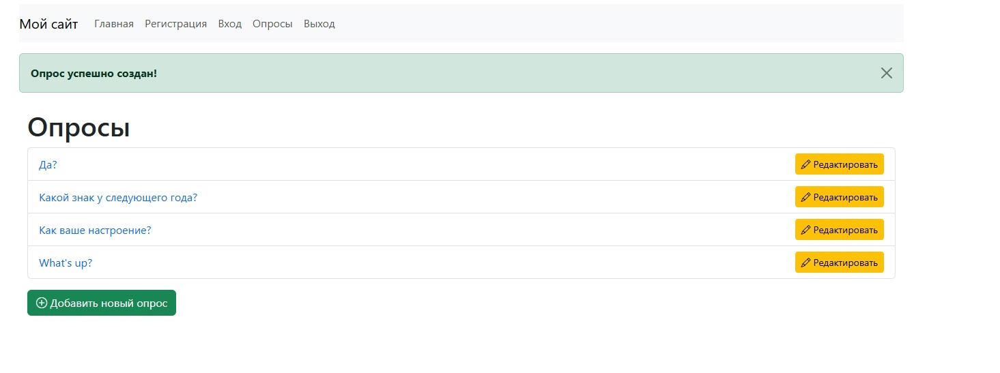

# Лабораторная работа 4 : Применение форм в Django. Аутентификация и регистрация пользователей.

В рамках этой лабораторной работы мной был усовершенствован сайт с опросами из ЛР3. Были добавлены регистрация и авторизация, возможность редактировать и создавать новые опросы не из панели админа.

## 1. Подготовительный этап

### Создание страницы home и базового шаблона base.html

Для удобства мной была сделана простенькая страница home, которая открывается по стандартному порту и является приветственной для пользователя, она наследуется от общего шаблона, который содержит в себе основное навигационное меню и обработку сообщений, которая нам понадобится в дальнейшем, основной шаблон выполнен при помощи Bootstrap.

**Главная страница (home)**: отображает приветственное сообщение и включает в себя ссылки на другие страницы, такие как вход, регистрация и опросы.

**Шаблон base.html**: является основой для всех других страниц, содержащий в себе навигационное меню, подключение стилей и скриптов Bootstrap.

```html
<body>

    <div class="container mt-4">

        <nav class="navbar navbar-expand-lg navbar-light bg-light">
            <a class="navbar-brand" href="#">Мой сайт</a>
            <button class="navbar-toggler" type="button" data-bs-toggle="collapse" data-bs-target="#navbarNav">
                <span class="navbar-toggler-icon"></span>
            </button>
            <div class="collapse navbar-collapse" id="navbarNav">
                <ul class="navbar-nav">
                    <li class="nav-item"><a class="nav-link" href="">Главная</a></li>
                    <li class="nav-item"><a class="nav-link" href="">Регистрация</a></li>
                    <li class="nav-item"><a class="nav-link" href="">Вход</a></li>
                    <li class="nav-item"><a class="nav-link" href="">Опросы</a></li>
                    
                        <li class="nav-item"><a class="nav-link" href="">Выход</a></li>
                    
                </ul>
            </div>
        </nav>

        <div class="mt-3">
            
                
                    
                        <div class="alert alert-success alert-dismissible fade show" role="alert">
                            <strong>{{ message }}</strong>
                            <button type="button" class="btn-close" data-bs-dismiss="alert" aria-label="Close"></button>
                        </div>
                    
                        <div class="alert alert-danger alert-dismissible fade show" role="alert">
                            <strong>{{ message }}</strong>
                            <button type="button" class="btn-close" data-bs-dismiss="alert" aria-label="Close"></button>
                        </div>
                    
                        <div class="alert alert-info alert-dismissible fade show" role="alert">
                            <strong>{{ message }}</strong>
                            <button type="button" class="btn-close" data-bs-dismiss="alert" aria-label="Close"></button>
                        </div>
                    
                
            
        </div>

        
    </div>
    <script src="https://cdn.jsdelivr.net/npm/bootstrap@5.3.0-alpha1/dist/js/bootstrap.bundle.min.js"></script>
</body>
```


## 2. Регистрация и авторизация
В рамках задания 1.2 была реализована система регистрации и аутентификации пользователей. Для этого были использованы формы `CustomUserCreationForm` и `CustomAuthenticationForm`.

### Реализация формы регистрации:
Форма регистрации `CustomUserCreationForm` включает в себя поля для ввода имени пользователя, электронной почты и пароля с подтверждением.
```python
class CustomUserCreationForm(forms.ModelForm):
    password1 = forms.CharField(label="Пароль", widget=forms.PasswordInput, required=True)
    password2 = forms.CharField(label="Подтверждение пароля", widget=forms.PasswordInput, required=True)
    email = forms.EmailField(label="Электронная почта", widget=forms.EmailInput)

    class Meta:
        model = User
        fields = ['username', 'email']  # Поля: имя пользователя и email

    def clean_email(self):
        email = self.cleaned_data.get('email')
        if User.objects.filter(email=email).exists():
            raise ValidationError("Этот email уже зарегистрирован.")
        return email

    def clean_password2(self):
        password1 = self.cleaned_data.get('password1')
        password2 = self.cleaned_data.get('password2')

        if password1 and password2 and password1 != password2:
            raise ValidationError("Пароли не совпадают.")
        return password2

    def save(self, commit=True):
        user = super().save(commit=False)
        user.set_password(self.cleaned_data["password1"])
        if commit:
            user.save()
        return user
```

### Реализация формы авторизации:
Для авторизации пользователей используется форма `CustomAuthenticationForm`, которая проверяет введенные имя пользователя и пароль.

```python
class CustomAuthenticationForm(AuthenticationForm):
    username = forms.CharField(widget=forms.TextInput(attrs={'class': 'form-control', 'placeholder': 'Имя пользователя'}))
    password = forms.CharField(widget=forms.PasswordInput(attrs={'class': 'form-control', 'placeholder': 'Пароль'}))

```


## 3. Реализация сообщений и редиректов

При успешной регистрации и авторизации пользователя выводятся сообщения с подтверждением, а также осуществляется редирект на главную страницу.

```python
def register(request):
    if request.method == 'POST':
        form = CustomUserCreationForm(request.POST)
        if form.is_valid():
            user = form.save()
            login(request, user)
            messages.success(request, 'Вы успешно зарегистрированы и вошли в систему!')
            return redirect('polls:home')
```



## 3. Улучшение создания опросов

В рамках задания 1.1 была реализована возможность добавления и редактирования опросов прямо на странице опросов.
Сама идея была взята из кода примера, который был оставлен в moodle, но адаптирована под мои задачи.

### Создание формы для добавления и редактирования опросов:
Для создания и редактирования опросов был взят класс `QuestionForm`, который использует поле для ввода вариантов ответов. Он был взят без изменений. 

```python
class QuestionForm(forms.ModelForm):
    choices = forms.CharField(
        label='Question Choices',
        widget=forms.Textarea(attrs={'rows': 7}),
        help_text='Enter the answer options, separating each option with a new line.'
    )

    class Meta:
        model = Question
        fields = ['question_text', 'choices']
```

### Добавление проверки для доступа к странице создания и редактирования опросов

Для предотвращения доступа к этим страницам пользователями, не являющимися администраторами, был использован декоратор `user_passes_test`, который проверяет, является ли текущий пользователь администратором (например, через `user.is_staff`).

В `views.py` была добавлена следующая проверка:

```python
# Декоратор для проверки прав администратора
def is_staff(user):
    return user.is_staff

@user_passes_test(is_staff)
def create_question(request):
    if request.method == 'POST':
        form = QuestionForm(request.POST)
        if form.is_valid():
            form.save()
            messages.success(request, 'Опрос успешно создан!')
            return redirect('polls:index')
        else:
            messages.error(request, 'Произошла ошибка при создании опроса.')
    else:
        form = QuestionForm()

    return render(request, 'polls/create_question.html', {'form': form})

@user_passes_test(is_staff)
def edit_question(request, pk):
    question = get_object_or_404(Question, pk=pk)

    if request.method == 'POST':
        form = QuestionForm(request.POST, instance=question)
        if form.is_valid():
            form.save()
            messages.success(request, 'Опрос успешно обновлен!')
            return redirect('polls:index')
        else:
            messages.error(request, 'Произошла ошибка при редактировании опроса.')
    else:
        form = QuestionForm(instance=question)

    return render(request, 'polls/edit_question.html', {'form': form, 'question': question})
```
## Ограничение на создание и редактирование опросов в шаблоне

На страницах, где отображаются кнопки для создания и редактирования опросов, была добавлена проверка на права пользователя. Если пользователь не является администратором, кнопки для создания и редактирования опросов будут скрыты.

### Пример шаблона с проверкой:

```html
    
        <a href="" class="btn btn-warning btn-sm">
            <i class="bi bi-pencil"></i> Редактировать
        </a>
    
```
### Пояснение:
Если пользователь не является администратором, то он не увидит кнопки редактирования и добавления на странице опросов. Для сравнения добавлены примеры отображения для обычного пользователя и для админа




### Дополнение:
Также были добавлены различные кнопки для удобства переходов между страницами